# ⚠️ 普罗米修斯数据简报 (AI分析失败)
**报告时间:** 2025-08-20 05:50:13 CST
**警告:** 因Gemini API配额耗尽，今日未生成智能分析。以下为原始数据摘要。
---
### 量化指标与趋势预测
| 基金名称 | 状态 | RSI(14) | MACD信号 | 未来30日趋势预测 |
| :--- | :--- | :--- | :--- | :--- |
| 沪深300基石 (510300) | 数据正常 | 70.42 | 金叉 | 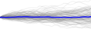 |
| 中证500中盘 (510500) | 数据正常 | 76.24 | 金叉 | 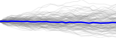 |
| 创业板50 (159949) | 数据正常 | 81.79 | 金叉 | 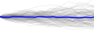 |
| 科创板50 (588000) | 数据正常 | 71.72 | 金叉 |  |
| 券商/牛市旗手 (512880) | 数据正常 | 69.26 | 金叉 |  |
| 银行/价值洼地 (512800) | 数据正常 | 40.92 | 死叉 | 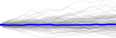 |
| 保险主题 (512900) | 数据正常 | 68.66 | 金叉 |  |
| 半导体/芯片 (512760) | 数据正常 | 69.34 | 金叉 | 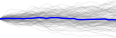 |
| 人工智能AI (515980) | 数据正常 | 84.70 | 金叉 | 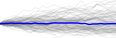 |
| 计算机/软件 (512720) | 数据正常 | 71.09 | 金叉 | 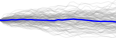 |
| 消费/食品饮料 (510630) | 数据正常 | 64.42 | 金叉 |  |
| 游戏动漫 (516010) | 数据正常 | 65.44 | 金叉 |  |
| 家电 (159996) | 数据正常 | 80.79 | 金叉 | 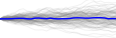 |
| 新能源车 (515030) | 数据正常 | 69.55 | 金叉 | 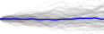 |
| 光伏产业 (515790) | 数据正常 | 67.60 | 金叉 |  |
| 军工龙头 (512680) | 数据正常 | 60.84 | 金叉 |  |
| 创新药 (159992) | 数据正常 | 61.15 | 死叉 | 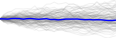 |
| 医疗器械 (159929) | 数据正常 | 61.13 | 死叉 |  |
| 恒生科技指数 (513130) | 数据正常 | 57.37 | 死叉 | 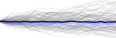 |
| 纳斯达克100 (513100) | 数据正常 | 58.68 | 死叉 | 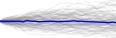 |

---
### 市场新闻摘要

- 冠盛股份股价连续4天下跌累计跌幅6.72%，永赢基金旗下1只基金持867.34万股，浮亏损失2428.55万元
- 创业板人工智能ETF大成（159242）涨2.41%，成交额9184.38万元
- 315在行动|天治新消费混合近三年亏损58.37% 换手率1434% 基民吐槽：坐等解散
- 创100ETF融通（159808）跌0.20%，成交额431.48万元
- 通信ETF广发（159507）涨1.49%，成交额982.05万元
- 方正中证500ETF（510550）涨0.00%，成交额175.82万元
- 国货ETF（561130）跌0.69%，成交额1202.01万元
- 科创50增强ETF南方（588370）跌1.09%，成交额745.81万元
- 创业板50ETF嘉实（159373）跌0.08%，成交额3280.75万元
- 亚翔集成股价连续4天下跌累计跌幅9.28%，国泰基金旗下2只基金合计持3.65万股，浮亏损失12.96万元
- 渝农商行股价连续9天下跌累计跌幅6.08%，华泰柏瑞基金旗下4只基金合计持1.52亿股，浮亏损失6380.25万元
- 现金流ETF基金（159225）跌0.52%，成交额403.70万元
- 泽璟制药股价跌5.21%，中银证券旗下2只基金重仓，合计持有13.3万股浮亏损失76.87万元
- 医疗ETF华泰柏瑞（516790）涨0.62%，成交额559.42万元
- ETF主力榜 | 800现金流ETF(563990)主力资金净流出854.33万元，居可比基金首位-20250819
---
*提示：要恢复AI智能分析，请为您的Google Cloud项目启用结算。*