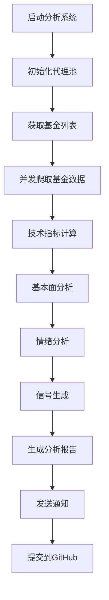

# 🚀 基金数据爬取与智能分析系统

[](https://github.com/your-username/fund-analysis/actions)
[](https://python.org)
[](LICENSE)
[](https://github.com/psf/black)

> 🎯 **一键式基金投资分析神器** - 全自动爬取基金数据，多维度智能分析，生成专业投资报告

## 📋 目录

- [✨ 系统特色](#-系统特色)
- [🏗️ 系统架构](#️-系统架构)
- [🚀 快速开始](#-快速开始)
- [⚙️ 配置说明](#️-配置说明)
- [📊 功能介绍](#-功能介绍)
- [📈 分析维度](#-分析维度)
- [🤖 自动化流程](#-自动化流程)
- [📱 使用示例](#-使用示例)
- [🔧 高级配置](#-高级配置)
- [🐛 故障排除](#-故障排除)
- [🤝 贡献指南](#-贡献指南)
- [📄 开源协议](#-开源协议)

## ✨ 系统特色

### 🎯 核心优势
- **🤖 全自动化**: GitHub Actions驱动，无需人工干预
- **🌐 多数据源**: 整合东方财富、天天基金、新浪财经等多个数据源
- **🧠 AI智能分析**: 技术面+基本面+情绪面多维度综合分析
- **📊 专业报告**: 自动生成投资级别的专业分析报告
- **⚡ 高性能**: 多线程并发处理，支持千只基金同时分析
- **🔒 数据安全**: 代理池轮换，反爬虫策略，确保数据获取稳定

### 🎨 技术亮点
- **智能代理管理**: 自动获取和管理代理IP池，突破访问限制
- **缓存优化**: 多级缓存策略，提升数据获取效率
- **容错处理**: 完善的异常处理和重试机制
- **实时监控**: 详细的日志记录和性能监控
- **模块化设计**: 高度解耦的模块化架构，易于扩展

## 🏗️ 系统架构

```
📦 基金分析系统
├── 🕷️ 数据爬取层
│   ├── 多源数据爬虫 (东方财富、天天基金、新浪财经等)
│   ├── 智能代理管理 (自动IP轮换)
│   └── 反爬虫策略 (User-Agent轮换、请求限速)
├── 🧠 分析引擎层
│   ├── 📈 技术分析 (MA、MACD、RSI、布林带等)
│   ├── 📊 基本面分析 (业绩、费用、风险等)
│   ├── 💭 情绪分析 (新闻舆情、市场情绪)
│   └── 🎯 信号生成 (买卖点智能识别)
├── 📋 报告生成层
│   ├── 📄 Markdown报告
│   ├── 🌐 HTML报告
│   ├── 📊 图表生成
│   └── 📧 邮件通知
└── 🤖 自动化层
    ├── GitHub Actions工作流
    ├── 定时任务调度
    └── 结果自动提交
```

## 🚀 快速开始

### 1️⃣ 创建GitHub仓库

```bash
# 克隆项目到你的GitHub仓库
git clone https://github.com/your-username/your-repo-name.git
cd your-repo-name

# 复制所有文件到你的仓库
# (将本项目的所有文件复制到你的仓库目录)

# 提交到你的仓库
git add .
git commit -m "初始化基金分析系统"
git push origin main
```

### 2️⃣ 配置GitHub Secrets

在你的GitHub仓库中设置以下Secrets：

| Secret名称 | 必需 | 说明 | 示例值 |
|------------|------|------|--------|
| `REPO_ACCESS_TOKEN` | ✅ | GitHub Personal Access Token | `ghp_xxxxxxxxxxxx` |
| `TELEGRAM_BOT_TOKEN` | ❌ | Telegram机器人Token | `123456:ABC-DEF...` |
| `TELEGRAM_CHAT_ID` | ❌ | Telegram聊天ID | `123456789` |
| `EMAIL_USERNAME` | ❌ | 邮箱用户名 | `your-email@gmail.com` |
| `EMAIL_PASSWORD` | ❌ | 邮箱密码或应用专用密码 | `your-app-password` |

#### 📝 如何创建GitHub Personal Access Token

1. 进入 GitHub Settings → Developer settings → Personal access tokens
2. 点击 "Generate new token (classic)"
3. 设置有效期和权限（勾选 `repo` 和 `workflow`）
4. 复制生成的token
5. 在仓库 Settings → Secrets and variables → Actions 中添加

### 3️⃣ 启动系统

```bash
# 系统会自动运行，或手动触发工作流
# 在GitHub仓库的Actions页面可以查看运行状态
```

### 4️⃣ 查看结果

- 📊 **分析报告**: `reports/` 目录下的Markdown和HTML文件
- 📈 **图表数据**: `reports/images/` 目录下的图表文件
- 📋 **原始数据**: `data/` 目录下的JSON数据文件
- 📝 **运行日志**: Actions页面的工作流日志

## ⚙️ 配置说明

### 🕷️ 爬虫配置

```python
# src/config.py
CRAWLER_CONFIG = {
    'max_workers': 20,              # 最大并发线程数
    'request_delay': (0.5, 2.0),   # 请求延迟范围
    'retry_times': 3,               # 重试次数
    'timeout': 30,                  # 超时时间
    'enable_proxy': True,           # 是否启用代理
}
```

### 📊 分析配置

```python
# 信号生成配置
SIGNAL_CONFIG = {
    'buy_signals': {
        'strong_buy': {'score_threshold': 80, 'confidence': 0.9},
        'buy': {'score_threshold': 60, 'confidence': 0.7},
    },
    'sell_signals': {
        'strong_sell': {'score_threshold': 20, 'confidence': 0.9},
        'sell': {'score_threshold': 40, 'confidence': 0.7},
    }
}
```

### ⏰ 定时任务配置

```yaml
# .github/workflows/fund_analysis.yml
on:
  schedule:
    - cron: '0 9,15,21 * * 1-5'  # 工作日9点、15点、21点
  workflow_dispatch:              # 手动触发
```

## 📊 功能介绍

### 🎯 核心功能

#### 1. 📈 多维度数据爬取
- **基金基础信息**: 基金代码、名称、类型、规模、费率等
- **历史净值数据**: 日净值、累计净值、涨跌幅等历史数据
- **基金经理信息**: 从业经验、管理规模、历史业绩等
- **持仓明细**: 前十大重仓股、行业配置、资产配置等
- **新闻舆情数据**: 基金相关新闻、市场评论、机构观点等

#### 2. 🧠 智能分析引擎
- **技术指标分析**: 20+种技术指标，包括MA、MACD、RSI、KDJ等
- **基本面分析**: 业绩评估、风险度量、费用分析、经理评价等
- **情绪分析**: 新闻情感分析、市场情绪指数、投资者情绪等
- **量化评分**: 综合多维度数据生成量化投资评分

#### 3. 🎯 智能信号生成
- **买卖点识别**: 基于多因子模型识别最佳买卖时机
- **风险评估**: 动态评估投资风险等级
- **仓位建议**: 根据风险偏好给出仓位配置建议
- **持有期预测**: 预测最佳持有周期

### 🔧 技术特性

#### 1. 🚀 高性能处理
- **多线程并发**: 最大20个线程同时处理
- **异步IO**: 高效的网络请求处理
- **智能缓存**: 多级缓存策略减少重复请求
- **批量处理**: 支持批量分析1000+基金

#### 2. 🛡️ 稳定性保障
- **代理池管理**: 自动获取和轮换代理IP
- **反爬虫策略**: User-Agent轮换、请求限速
- **异常处理**: 完善的错误处理和恢复机制
- **重试机制**: 智能重试失败的请求

#### 3. 📊 专业报告
- **多格式输出**: Markdown、HTML、JSON多种格式
- **图表生成**: 自动生成专业的分析图表
- **模板定制**: 支持自定义报告模板
- **邮件通知**: 自动发送分析结果邮件

## 📈 分析维度

### 📊 技术分析 (35%权重)

#### 趋势指标
- **移动平均线**: MA5、MA10、MA20、MA60分析
- **均线排列**: 多头排列、空头排列、震荡排列
- **金叉死叉**: 短期均线与长期均线交叉信号
- **乖离率**: 价格与均线的偏离程度

#### 振荡指标
- **MACD**: 指数移动平均收敛发散指标
- **RSI**: 相对强弱指数，判断超买超卖
- **KDJ**: 随机指标，短期买卖信号
- **CCI**: 商品通道指数，价格偏离度

#### 通道指标
- **布林带**: 价格通道和波动性分析
- **支撑阻力**: 关键价格支撑和阻力位
- **通道突破**: 价格突破重要技术位

### 💰 基本面分析 (30%权重)

#### 业绩指标
- **收益率**: 近1年、3年、5年年化收益率
- **夏普比率**: 风险调整后的收益率
- **最大回撤**: 历史最大亏损幅度
- **波动率**: 净值波动的标准差
- **胜率**: 正收益交易日占比

#### 风险指标
- **Beta系数**: 相对市场的风险系数
- **Alpha系数**: 超额收益能力
- **VaR**: 风险价值，95%置信度下的最大损失
- **跟踪误差**: 相对基准的偏离程度
- **信息比率**: 主动管理能力评价

#### 基金属性
- **基金规模**: 管理资产规模及变化趋势
- **费用结构**: 管理费、托管费、销售费用分析
- **基金经理**: 从业经验、管理能力评估
- **公司实力**: 基金公司规模和声誉

### 💭 情绪分析 (20%权重)

#### 新闻情绪
- **情感分析**: 新闻标题和内容的情感倾向
- **关键词提取**: 热点话题和关注焦点
- **时间序列**: 情绪变化趋势分析
- **来源权重**: 不同媒体的影响力权重

#### 市场情绪
- **恐慌贪婪指数**: 市场整体情绪指标
- **VIX指数**: 波动率指数，恐慌情绪
- **资金流向**: 申购赎回资金流向
- **机构观点**: 专业机构投资建议

### 🌍 市场环境 (15%权重)

#### 宏观环境
- **经济指标**: GDP、CPI、PMI等宏观数据
- **货币政策**: 利率、流动性环境
- **政策环境**: 相关政策对基金的影响
- **国际环境**: 全球市场和汇率影响

#### 行业环境
- **行业轮动**: 热点行业和冷门行业
- **估值水平**: 行业估值的历史分位
- **盈利预期**: 行业盈利增长预期
- **政策支持**: 政策对行业的支持力度

## 🤖 自动化流程

### 📅 定时执行

系统在以下时间自动执行：
- **🌅 早盘**: 9:00 AM (开盘前分析)
- **🌆 午盘**: 3:00 PM (收盘后分析)  
- **🌙 晚盘**: 9:00 PM (深度分析)

### 🔄 执行流程



### 📊 数据处理流程

1. **数据爬取阶段** (10-15分钟)
   - 获取1000+基金的基础信息
   - 爬取历史净值数据
   - 收集相关新闻数据

2. **数据分析阶段** (20-30分钟)
   - 并行计算技术指标
   - 基本面指标分析
   - 情绪分析处理

3. **报告生成阶段** (5-10分钟)
   - 生成个股分析报告
   - 生成市场概况报告
   - 生成图表和可视化

4. **结果输出阶段** (2-5分钟)
   - 保存分析结果
   - 发送邮件/消息通知
   - 提交到GitHub仓库

## 📱 使用示例

### 🎯 查看分析结果

#### 1. 📊 个股分析报告
```markdown
# 📊 易方达消费行业 (110022) 基金投资分析报告

## 🎯 投资建议
**综合评级**: 买入 (置信度: 85%)
**风险等级**: 中等风险
**建议仓位**: 20-30%
**预期持有期**: 3-6个月

## 📈 关键指标
- 年化收益率: 15.8%
- 最大回撤: -18.5%
- 夏普比率: 1.25
- 技术评分: 78/100
```

#### 2. 📈 市场概况报告
```markdown
# 📈 基金市场每日概况

## 🏆 今日推荐 (强烈买入)
1. 易方达消费行业 (110022) - 85%置信度
2. 中欧医疗健康 (003095) - 82%置信度
3. 汇添富消费行业 (000248) - 78%置信度

## ⚠️ 风险提示 (建议卖出)
1. 某科技主题基金 (xxxxxx) - 风险预警
2. 某周期性行业基金 (xxxxxx) - 下行趋势
```

### 💌 邮件通知示例

```
主题: ✅ 基金分析任务完成 - 2024-01-15

📊 基金分析系统通知
⏰ 时间: 2024-01-15 21:30:15
📈 状态: ✅ SUCCESS

📋 分析摘要:
• 总基金数: 1,247
• 成功分析: 1,203
• 失败分析: 44
• 生成报告: 156

🎯 重点关注:
• 易方达消费行业: 强烈买入 (置信度: 85%)
• 中欧医疗健康: 买入 (置信度: 82%)
• 汇添富消费行业: 买入 (置信度: 78%)

📊 市场概况:
• 平均技术得分: 58.7/100
• 平均基本面得分: 62.3/100
• 买入信号数量: 89
• 卖出信号数量: 23
```

## 🔧 高级配置

### 🎛️ 自定义分析参数

```python
# 修改 src/config.py 中的配置
ANALYSIS_CONFIG = {
    'technical_indicators': [
        'SMA_5', 'SMA_10', 'SMA_20',  # 添加自定义技术指标
        'MACD', 'RSI_14', 'BOLL',
        # 添加更多指标...
    ],
    'signal_weights': {
        'technical': 0.4,      # 技术分析权重
        'fundamental': 0.3,    # 基本面权重
        'sentiment': 0.2,      # 情绪分析权重
        'market': 0.1          # 市场环境权重
    }
}
```

### 📊 自定义报告模板

```markdown
<!-- 修改 templates/fund_report_template.md -->
# 🎯 {{fund_name}} 投资分析

## 核心观点
{{executive_summary}}

## 投资建议
- 信号: {{signal_type}}
- 置信度: {{confidence}}
- 目标价: {{target_price}}

<!-- 添加自定义内容... -->
```

### 🔔 配置通知方式

```python
# 在GitHub Secrets中配置
TELEGRAM_BOT_TOKEN = "your-bot-token"
TELEGRAM_CHAT_ID = "your-chat-id"
EMAIL_USERNAME = "your-email@gmail.com"
EMAIL_PASSWORD = "your-app-password"
```

### 🕷️ 代理配置

```python
# 系统自动管理代理，也可手动配置
SECURITY_CONFIG = {
    'proxy_sources': [
        'https://your-proxy-source-1.com',
        'https://your-proxy-source-2.com',
    ],
    'rate_limiting': {
        'requests_per_minute': 60,
        'requests_per_hour': 1000
    }
}
```

## 🐛 故障排除

### ❓ 常见问题

#### 1. GitHub Actions运行失败
**问题**: 工作流执行失败
**解决方案**:
- 检查 `REPO_ACCESS_TOKEN` 是否正确设置
- 确认token权限包含 `repo` 和 `workflow`
- 查看Actions日志中的具体错误信息

#### 2. 数据爬取失败
**问题**: 无法获取基金数据
**解决方案**:
- 检查网络连接
- 系统会自动重试和使用代理
- 查看日志中的具体错误信息

#### 3. 分析报告生成失败
**问题**: 报告生成不完整
**解决方案**:
- 检查数据完整性
- 查看模板文件是否正确
- 检查依赖库是否正常安装

#### 4. 通知发送失败
**问题**: 邮件或消息通知失败
**解决方案**:
- 检查通知配置参数
- 确认邮箱密码为应用专用密码
- 检查Telegram bot配置

### 📝 调试方法

#### 1. 查看详细日志
```bash
# 在GitHub Actions页面查看工作流日志
# 或在本地运行时查看控制台输出
```

#### 2. 本地调试
```bash
# 克隆项目到本地
git clone https://github.com/your-username/your-repo.git
cd your-repo

# 安装依赖
pip install -r requirements.txt

# 运行主程序
python src/main.py
```

#### 3. 检查配置
```bash
# 检查配置文件
cat src/config.py

# 检查GitHub Secrets设置
# 在仓库Settings -> Secrets页面查看
```

### 🔧 性能优化

#### 1. 调整并发数
```python
# 根据网络情况调整并发线程数
CRAWLER_CONFIG = {
    'max_workers': 10,  # 降低并发数减少被限制
}
```

#### 2. 增加请求延迟
```python
# 增加请求间隔避免被封IP
CRAWLER_CONFIG = {
    'request_delay': (1.0, 3.0),  # 增加延迟范围
}
```

#### 3. 启用缓存
```python
# 启用缓存减少重复请求
use_cache = True
```

## 🤝 贡献指南

### 💻 开发环境搭建

```bash
# 1. Fork并克隆项目
git clone https://github.com/your-username/fund-analysis.git
cd fund-analysis

# 2. 创建虚拟环境
python -m venv venv
source venv/bin/activate  # Windows: venv\Scripts\activate

# 3. 安装依赖
pip install -r requirements.txt
pip install -r requirements-dev.txt  # 开发依赖

# 4. 安装pre-commit钩子
pre-commit install
```

### 🔧 代码规范

- **代码风格**: 使用 Black 格式化代码
- **类型检查**: 使用 mypy 进行类型检查
- **文档字符串**: 使用 Google 风格的文档字符串
- **测试覆盖**: 新功能需要包含相应的单元测试

### 📝 提交规范

```bash
# 提交格式
feat: 新增功能
fix: 修复bug
docs: 文档更新
style: 代码格式调整
refactor: 代码重构
test: 测试相关
chore: 构建/工具相关

# 示例
git commit -m "feat: 添加新的技术指标分析功能"
git commit -m "fix: 修复代理管理器内存泄漏问题"
```

### 🎯 贡献方向

1. **🔧 新功能开发**
   - 新的技术指标
   - 更多数据源
   - 新的分析方法

2. **🐛 Bug修复**
   - 爬虫稳定性
   - 分析准确性
   - 性能优化

3. **📚 文档完善**
   - 使用文档
   - API文档
   - 示例代码

4. **🧪 测试改进**
   - 单元测试
   - 集成测试
   - 性能测试

## 📄 开源协议

本项目采用 [MIT License](LICENSE) 开源协议。

### 📋 许可条款

- ✅ **商业使用**: 允许用于商业项目
- ✅ **修改**: 允许修改源代码
- ✅ **分发**: 允许分发修改后的代码
- ✅ **私人使用**: 允许私人使用
- ❌ **责任**: 作者不承担任何责任
- ❗ **许可和版权声明**: 必须包含原始许可和版权声明

### 🙏 致谢

感谢以下开源项目和服务：

- **数据来源**: 东方财富、天天基金、新浪财经等
- **技术栈**: Python、pandas、requests、beautifulsoup4等
- **部署平台**: GitHub Actions
- **图表库**: matplotlib、plotly
- **机器学习**: scikit-learn

---

## 📞 联系我们

- **GitHub Issues**: [提交问题和建议](https://github.com/your-username/fund-analysis/issues)
- **GitHub Discussions**: [参与讨论](https://github.com/your-username/fund-analysis/discussions)
- **Email**: your-email@example.com

---

## ⭐ Star History

如果这个项目对你有帮助，请给我们一个 ⭐ Star！

[](https://star-history.com/#your-username/fund-analysis&Date)

---

**💡 提示**: 投资有风险，本系统提供的分析仅供参考，不构成投资建议。请谨慎投资，理性决策。

---

*🤖 本项目完全开源免费，由基金分析系统自动维护和更新。*
